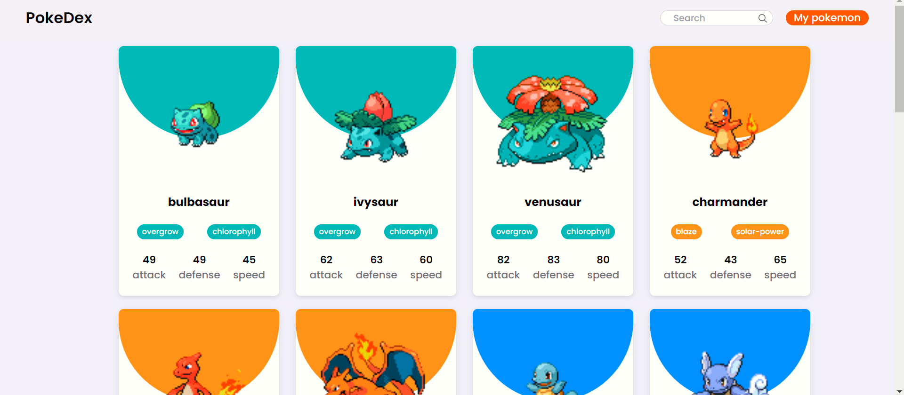
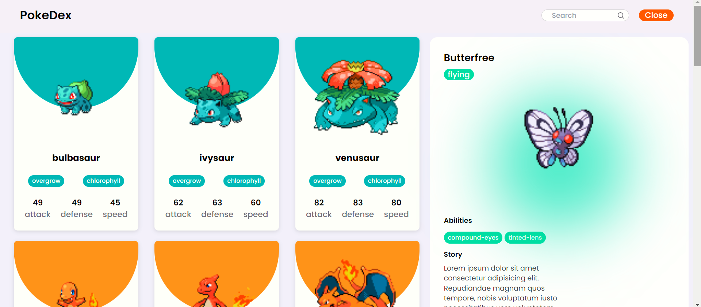
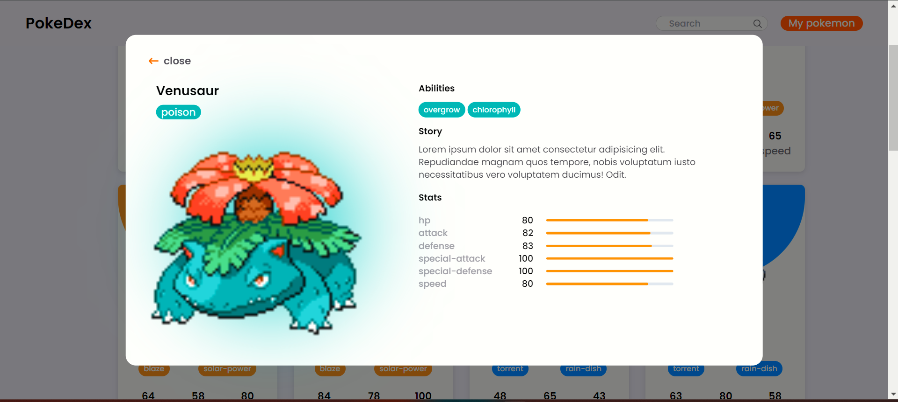

# Pokedex

## Features

- **Searching:** Easily search for specific Pokémon by name.
- **Access your Pokémon:** View your Pokémon collection with detailed information.
- **Dynamic Syncing:** Click on the `My Pokemon` button to access your Pokémon. The Pokémon displayed will change randomly when accessed on a different system or in incognito mode.
- **Pokémon Details:** Click on any Pokémon card to view comprehensive details about that Pokémon.

## Tech Stack

- React
- Tailwind CSS
- Axios

## Installation

To install the required dependencies, run:

```
npm install
```

To run the app, execute:

```
npm run dev
```

## Screenshots

### Home Page:


### User Pokemon Card:


### Single Card:

    